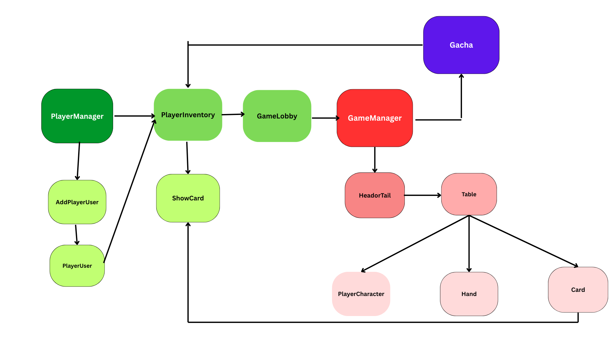

# PROJECT2-SEC-1-CaptainSoviet
-------------------------------
        Group Member
-------------------------------
1. **Natkamon Chotipiboonsub** 66130500028 | 27%
- [x] R&G System (Head or Tail)
- [x] Card Mechanicsm System
- [x] Player Character (Player's profile)
- [x] Maps Background
2. **Songkiatchai Wongthaidee** 66130500035 | 26%
- [x] Main Game Logic (Calculate Score)
- [x] Card System
- [x] Table System
- [x] Round System
3. **Thiti Prasopsub** 66130500044 | 27%
- [x] Inventory (Deck System)
- [x] PlayerManager
- [x] Card Available
- [x] Setting
- [x] Gacha System (Optional)
4. **Pratchaya Champates** 66130500058 | 20%
- [x] Player Inventory
- [x] PlayerManager
- [x] Card Available
- [x] Card Design & Visual Motion (Optional)

**Update CheckBox by remove blank space & add "X" in the box to certify what feature has finished.**

### Project Name: Meme's Blood: война(Voyna) Of Meme
##### Main Feature of This Project:
- Player Save
- Card Available
- User Inventory
- Coins & Gacha System (Optional)
- Main Game Logic (Score Calculator)
- Card Mechanism
- CardHolder Highlight
- Card Deck System
- Lobby

##### Progress Table
| Week      | StudentID        | Description                                                                                     |
|-----------|------------------|-------------------------------------------------------------------------------------------------|
| WEEK 1    |028, 035, 044, 058| Create Git Repo, Invitation                                                                     | **START REMOVE FROM THIS LINE AND MAKE SURE THE PIPE WAS IN THE SAME ROW**
| WEEK 2    |028, 035, 044, 058| Discuss Our Project Name, Brainstorming concept, Give members Responsibilities                  |
| --------- |044               | Make a template and components                                                                  | 
| WEEK 3    |044               | Start Create User Function, Login-Logout, mainmenu, auto add player inventory                                                        |
| --------- |028               | Create Flipping Coin (Head or Tail), Card layout, Create Player Character                       |
| --------- |035               | Create Card & Table Layout, Lane & Square Component Layout, Sample Table System                 |
| --------- |058               | Show Inventory after login                                                                      |
| WEEK 4    |058               | Make it show only login-user inventory, Card Picture Package, Fix bug Inventory not Update, Sound volume setting page      |
| --------- |044               | add deck system include add edit remove deck and show card in deck                              |
| --------- |035               | Add expand pawn on board system, Add random buff/debuff system on board, Add Round System, Fetch card's data from backend to Hand           |
| --------- |028               | Update player layout position, Add sample buff/debuff, Add pawn locations card in db.json, Fetch player's data from backend       |
| WEEK 5    |044               | add Lobby menu, show character picture in game and menu and create working score system in main game and make pawn cannot add more than 3 |
| ------    |044(2)            | real time culcuate score in row make end game condition |
| ------    |058               | Setting-Up Game BGM, hover button sound, Legendary Card sound |
| ------    |028               | Flip coin to start player 1 or 2, Prevent multiple click flip coin button, Template and Prevent multiple spin gacha, Add maps background |
| ------    |035               | Manage Layout In PlayerInventory, Card and GameManager, Add randam card system, Add 3 card to each player at Begining, Add 1 random card after skip turn Or change turn, Validate Play Button in GameLobby |

##### This table was create for certify what you have done in each week within short Description by remove the line that i was marked
##### For example:
| Week      | StudentID | Description              |
|-----------|-----------|--------------------------|
| WEEK1     |001        | Create Template Vue      | 
|           |002        | Add CSS, Edit Readme     |

Link Canvas: https://www.canva.com/design/DAGg3UiWM9I/c3aZno6du29kA-xayBNQ-A/edit  
Ref Game tutorial: https://youtu.be/K5z-ZRQD5-I?si=ZQtLipoMNth4nbUh  
Our video tutorial: https://drive.google.com/file/d/1j80LWndOCfFGyWa4081nprtzQwbeiPAe/view?usp=sharing  

<b>Account admin</b>  
User: test1  
Password: test1

<b>Rule of Game:</b>
1. การลงไพ่ต้องมีจำนวนหมากที่กำหนดตามกระดาน เป็นอย่างน้อย (จำนวนหมากของไพ่แต่ละใบ ดูจากซ้ายบนของไพ่)
2. การจะเพิ่มหมากไปในทิศทางไหน ดูจากช่องสีเหลืองของไพ่แต่ละใบ โดยสีขาวคือตำแหน่งไพ่ที่เราจะวางบนกระดาน
3. buff คือ จะเพิ่มคะแนนตามจำนวนของพลัง หรือการ x2 ของไพ่นั้นๆ เช่น ไพ่มีค่าพลัง 6 พอ buff จะเป็น 12 แต้ม
4. debuff คือ จะลดคะแนนตามจำนวนของพลังของไพ่นั้นๆ ในฝ่ายตรงข้าม ของแถวนั้นๆ เช่น ไพ่มีค่าพลัง 3 พอ debuff จะลดคะแนน 3 แต้ม ในฝ่ายตรงข้าม

